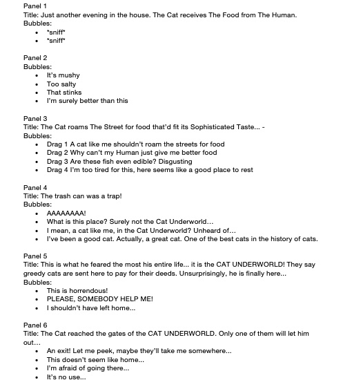

# :cat2: Dinner and a Walk
#### By the wonderful: Juan, Elina, Adina, and Nouf 
## The comic:
#### The comic takes us through a day in Cat's life. We start off in Cat's home where he refuses to eat the food his Human gave him so he goes on a stroll in search of better food and returns home with a lesson he'll never forget.
The comic takes place in two environments: the cat's home and an alternate _cat underworld_, each one represented by its own color scheme and artistic style. We set out to create an experience that contrasts the two environments and showcases Cat's often silly errors in an environment that is terrifying to the cat, but light-hearted for the viewer.
## The process:
### 🐾 First:
#### - We went through a few rough sketches and scripts of comics before we settled on one revolving around an arrogant cat.
##### This one!

### 🐾 After settling on that story:
#### - We created a wireframe with an even better storyline!

### 🐾 Then, we settled on an artistic style (or rather, the contrast of two):
We settled on collage backgrounds, one dominated by light tones (Cat's home) and one dominated by darker ones (the Cat underworld). In order to tie the cat environments together, we decided to compose the collages with elements related to cats: newspaper clippings, cat food wrappers, sardines, and cat pop art. In this sense, we attempted to generate environments that both make sense to the user and interact with the character of the cat: the users infer through the visual language the cat should be terrified of the Cat underworld, and should be comfortable in its house, but without ascribing strong feelings themselves to the environments.
#### - Here are some of them!
#### - The Cat Home

#### - The Cat Underworld

### 🐾 Then our Cat came to life:
We decided for our cat to be simply drawn: it improves visibility against the complex backgrounds. We composed different poses of the cat and a walking animation.
#### - Here he is thriving!

### 🐾 Then the script came to life too!

### 🐾 Then, we put the elements together in a web layout.

